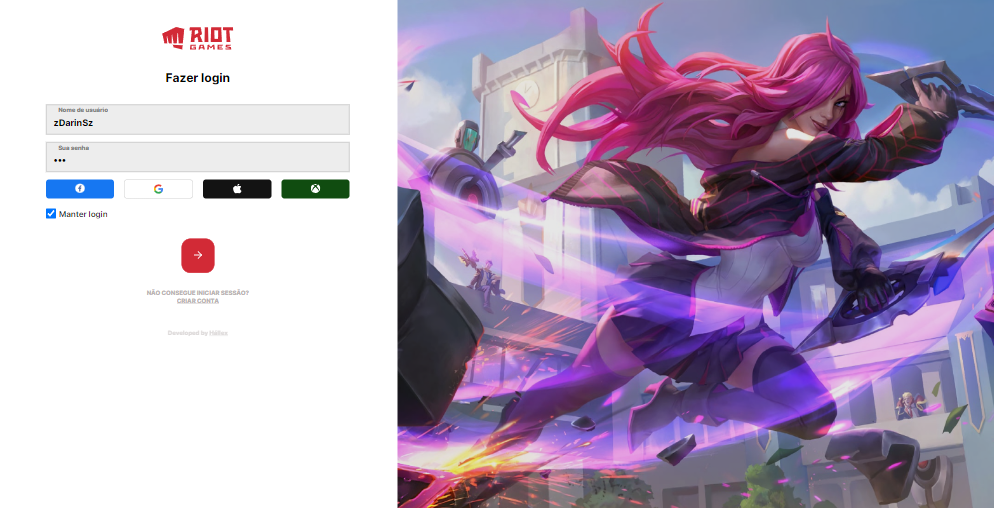
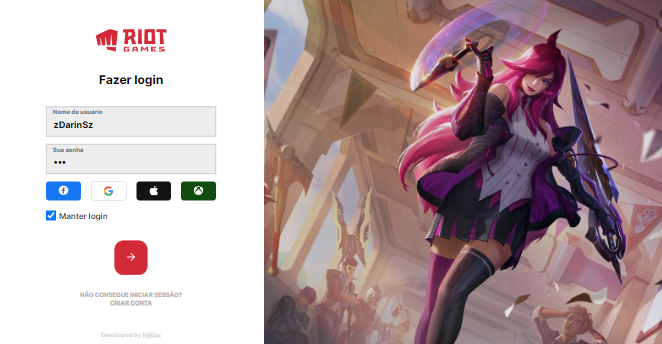
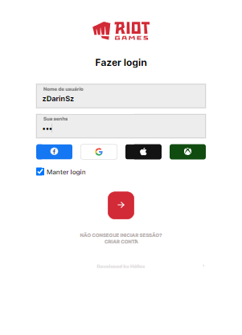
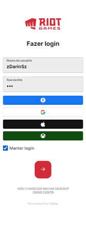

# League of Legends

This is a clone from League of Legends - Login Client.  
You can access the project click to [here](https://league-of-legends-client-login.netlify.app/)
or click to [here](https://www.figma.com/file/zPDVFsEM9hnzs02vnZSvCz/League-of-Legends---Login-UI---Clone?node-id=0%3A1&t=QGUHd87xJ77V8gzr-1) to access Design Figma.

# Features
- [x] [Dark Mode](./docs/SCREENS-DARK-MODE.md)

### Extra large screen

### Large screen

### Small screen

### Extra small screen

Inspired by [Riot Games Client](https://www.riotgames.com/en)
